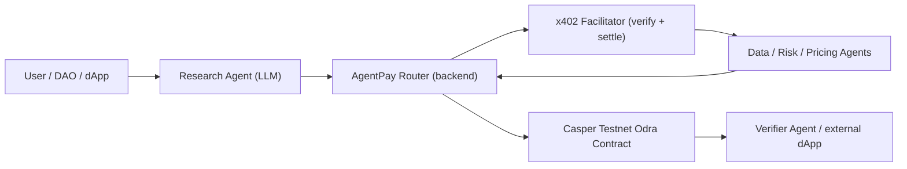

# AgentPay Router

AgentPay Router is a Casper-based payment, proof, and reputation layer for
autonomous agent-to-agent commerce. An AI Research Agent discovers paid
services, receives a real x402 payment challenge, decides whether the service
is worth the cost, settles the payment through the Casper x402 Facilitator, and
records a verifiable settlement receipt on Casper Testnet.

The differentiator is not the payment primitive (Casper already ships x402) but
the **routing + reputation + policy layer** on top of it: deciding which
services to buy, enforcing budget and reputation policy, and producing receipts
other agents can verify before trusting a paid result.

## Demo

- Video walkthrough: [docs/agentpay-router-live-demo.mp4](docs/agentpay-router-live-demo.mp4)
- Confirmed on-chain settlement tx: [`88b93c07…de5eb2`](https://testnet.cspr.live/deploy/88b93c07f02f316bd9edf514b797b9d1191001023360b14d23418d8040de5eb2) (Casper Testnet)

## Hackathon Fit

Built for the **Casper Agentic Buildathon** ($150k), which launched alongside
the Casper AI Toolkit (live x402 payments, Casper MCP Server, CSPR.click agent
skill). AgentPay Router targets the agent-economy layer the toolkit was built
for: agents paying each other per request, with verifiable proof and reputation.

The project demonstrates:

- **Agentic decision-making** — an LLM-driven Research Agent decides whether to
  buy external services given budget and reputation policy.
- **Real x402 payments** — service agents issue an HTTP 402 challenge; the
  router settles through the Casper x402 Facilitator.
- **Casper settlement** — an Odra contract records payment proof, service IDs,
  task result hash, and reputation changes.
- **Composable trust** — other agents can verify a receipt before trusting a
  paid result.

## What is real vs simulated

Every integration is built as a real call and degrades to a clearly-labeled
simulation when its credentials are absent (so the demo always runs). `GET
/api/health` reports which are live.

| Layer | Real implementation | Falls back to |
| --- | --- | --- |
| Agent decision | OpenAI-compatible LLM (`server/llm.js`) | deterministic policy heuristic |
| Payment authorization | Real x402 via CSPR.cloud facilitator `/verify` + `@make-software/casper-x402` EIP-712 signing (`server/x402.js`) | flagged simulated proof |
| On-chain settlement | Real native CSPR transfer to the provider via `casper-js-sdk` v5 (`server/casper.js`) — produces a verifiable Testnet tx hash | flagged simulated hash |
| Contract (optional) | Odra contract `record_payment` when deployed (`contracts/odra-router`) | transfer mode above |

A confirmed example settlement transaction:
`88b93c07f02f316bd9edf514b797b9d1191001023360b14d23418d8040de5eb2`
(Casper Testnet, viewable on testnet.cspr.live).

Simulated values are always prefixed `[sim]` / `[simulated]` in the UI and API.
Set `AGENTPAY_STRICT=1` to make missing config throw instead of simulating.

### Settlement flow

1. The service agent returns an HTTP 402 challenge with x402 payment requirements.
2. The buyer/router key signs an EIP-712 `transfer_with_authorization`; the
   CSPR.cloud facilitator **verifies** it (`/verify` → `isValid`).
3. The router **settles on Casper Testnet** as a real native CSPR transfer to the
   provider, returning the receipt's transaction hash.
4. Set `X402_FACILITATOR_SETTLE=1` to instead settle WCSPR through the facilitator
   (`/settle`), which requires the buyer to hold WCSPR.

## Official resources & test access

The Casper AI Toolkit ships everything needed to run this for real, and most of
it is free for buildathon teams:

- **x402 Facilitator (CSPR.cloud)** — `https://x402-facilitator.cspr.cloud`,
  endpoints `GET /supported`, `POST /verify`, `POST /settle`. Settles the
  `exact` scheme using CEP-18 tokens authorized via EIP-712 signatures; the
  facilitator pays the gas. Buildathon teams get **sponsored facilitator
  access**. Docs: https://docs.cspr.cloud/x402-facilitator-api/reference
- **CSPR.cloud access token** — register free at https://console.cspr.build to
  get an access token (UUID). Sent as the `authorization` header for both the
  facilitator and the Casper node RPC. Docs: https://docs.cspr.cloud
- **Casper node RPC** — CSPR.cloud provides a maintained testnet/mainnet node;
  no need to run your own.
- **Testnet faucet** — free test CSPR at https://testnet.cspr.live/tools/faucet
  (log in with Casper Wallet, one request per account). Used to fund the buyer
  account so it holds the CEP-18 test token and can authorize transfers.
- **Official x402 JS library** — `@make-software/casper-x402` (already a
  dependency here) handles the EIP-712 `transfer_with_authorization` signing.
  Examples: https://github.com/make-software/casper-x402
- **CSPR.click AI Agent Skill** — teaches a coding agent to wire wallet
  connect, signing, and CSPR.cloud APIs: `npx skills add
  https://github.com/make-software/csprclick-examples/tree/master/csprclick-skill`
- **Casper MCP / CSPR.trade MCP** — let agents query chain state and DeFi.
- **Buildathon** — https://dorahacks.io/hackathon/2202/detail

### To go fully live

1. Register on https://console.cspr.build → copy the access token into
   `CSPR_CLOUD_ACCESS_KEY`.
2. Fund a testnet account at the faucet; export its secret key PEM →
   `CASPER_SECRET_KEY_PATH`. This is the buyer (router) key.
3. Point `X402_ASSET` at the CEP-18 test token package hash and set
   `X402_PAY_TO` to the payee public key. Match `X402_ASSET_*` to the token's
   EIP-712 domain (name/version/decimals/symbol).
4. Deploy the Odra contract (see `contracts/odra-router`) → set
   `CASPER_ROUTER_CONTRACT_HASH` and `CASPER_NODE_RPC_URL`.

## Architecture



## Run Locally

```bash
npm install
cp .env.example .env   # optional: add keys to go from SIMULATED to LIVE
npm start
```

Then open http://127.0.0.1:5173

Without any `.env`, the app runs fully in simulation mode. Add credentials per
section in `.env.example` to make each layer real, independently.

## Project Files

- `index.html`, `styles.css` — dashboard UI.
- `src/app.js` — frontend; calls the backend `/api/run` orchestration.
- `server/` — Node backend:
  - `index.js` — Express app + `/api/run` orchestration.
  - `llm.js` — Step 3: real agent decision.
  - `x402.js` — Step 1: real x402 challenge + facilitator settle.
  - `casper.js` — Step 2: real Casper deploy via `casper-js-sdk`.
  - `agents.js`, `config.js` — registry and configuration.
- `contracts/odra-router/` — Step 4: Odra settlement contract (Rust).
- `contracts/agentpay_router_interface.md` — contract interface reference.
- `SUBMISSION.md` — DoraHacks submission copy and demo script.

## API

- `GET /api/health` — which integrations are live vs simulated.
- `GET /api/catalog` — service registry and task profiles.
- `POST /api/run` — run one autonomous paid task; returns decision, trace, receipt.

## Why This Matters

Most AI agents can recommend actions but cannot reliably participate in
machine-to-machine commerce. AgentPay Router gives agents a payment, proof, and
reputation layer so autonomous systems can buy data, pay APIs, verify delivery,
and build trust over time on Casper.
